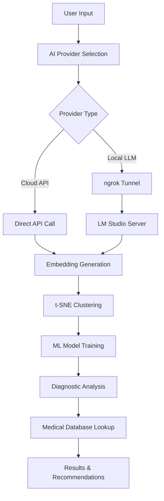

# 🩺 NWorks - GP's Assistant Diagnostician

> **AI-Powered Medical Diagnosis Assistant** - Revolutionizing healthcare diagnostics with advanced machine learning and local LLM integration.

<div align="center">

[](https://gpai-nworks.streamlit.app/)
[](https://www.python.org/downloads/)
[](https://opensource.org/licenses/MIT)

**[🚀 Try Live Demo](https://gpai-nworks.streamlit.app/)** | **[📹 Video Walkthrough](#-video-walkthrough)** | **[⚡ Quick Start](#-quick-start)**

</div>

---

## 🌟 Overview

GP's Assistant Diagnostician is a cutting-edge AI-powered medical diagnosis tool that combines machine learning clustering, advanced embeddings, and medical knowledge databases to provide intelligent symptom analysis and diagnostic insights.

### ✨ Key Features

- **🤖 Multi-AI Provider Support**: Mistral AI, OpenAI, Google Gemini, and **Local LLM integration**
- **🏥 Built-in Medical Database**: Comprehensive medical information and preventive measures
- **📊 Advanced Data Visualization**: Interactive t-SNE clustering and diagnostic insights
- **🔒 Privacy-First**: Support for local LLM servers with ngrok tunneling
- **⚡ Real-time Processing**: High-speed embeddings generation and analysis
- **🎯 Confidence Scoring**: Intelligent diagnostic confidence assessment
- **📱 Responsive Design**: Works seamlessly on desktop and mobile devices

---

## 🎬 Video Walkthrough

<iframe width="560" height="315" src="[https://www.youtube.com/embed/video-id](https://www.youtube.com/watch?v=BjGXEOjJltU&t=40s)" frameborder="0" allow="accelerometer; autoplay; clipboard-write; encrypted-media; gyroscope; picture-in-picture" allowfullscreen></iframe>
---

## ⚡ Quick Start

### 🌐 Online Demo (Fastest)

1. **Visit**: [https://gpai-nworks.streamlit.app/](https://gpai-nworks.streamlit.app/)
2. **Configure API**: Choose your AI provider (Mistral AI, OpenAI, or Local LLM)
3. **Start Diagnosing**: Follow the 5-step workflow for medical analysis

---

## 🚀 Local LLM Setup with ngrok

### Why Use Local LLMs?

- **🔒 Complete Privacy**: Your medical data never leaves your network
- **⚡ High Performance**: No API rate limits or costs
- **🎛️ Full Control**: Choose your preferred models and configurations
- **🌐 Cloud Accessible**: Use ngrok to make your local server cloud-accessible

### Step-by-Step Setup

#### 1. Install LM Studio

1. Download **[LM Studio](https://lmstudio.ai/)** for your operating system
2. Install and launch LM Studio
3. Download embedding models (recommended: `text-embedding-nomic-embed-text-v1.5`)

#### 2. Start Local Server

1. In LM Studio, go to **"Local Server"** tab
2. Load your embedding model
3. Click **"Start Server"** (default port: 1234)
4. Verify server is running at `http://localhost:1234`

#### 3. Set Up ngrok Tunnel

```bash
# Install ngrok from https://ngrok.com
# Download and extract ngrok

# Start ngrok tunnel with proper headers for LM Studio
ngrok http 1234 --host-header="192.168.1.16:1234" --log=stdout
```

**Important**: Always use the `--host-header` flag for LM Studio compatibility!

#### 4. Configure in GP's Assistant

1. Copy your ngrok HTTPS URL (e.g., `https://abc123.ngrok-free.app`)
2. In the app sidebar, select **"Local LLM"** as your provider
3. Paste your ngrok URL in **"Public Server URL"**
4. Click **"🔄 Refresh"** to load your models
5. Click **"Configure Embeddings API"**

### 🔧 Troubleshooting ngrok

**Problem**: ERR_NGROK_3200 error
```bash
# Solution: Restart ngrok with proper headers
ngrok http 1234 --host-header="192.168.1.16:1234" --log=stdout
```

**Problem**: Models not loading
1. Ensure LM Studio server is running
2. Verify model is loaded in LM Studio
3. Test ngrok URL in browser: `https://your-url.ngrok-free.app/v1/models`
4. Check that you see JSON response with model data

---

## 📋 5-Step Workflow

### Step 1: 📊 Data Ingestion
- Load medical symptom datasets from URL or file upload
- Preview and validate data structure
- Support for CSV format with symptom-diagnosis mappings

### Step 2: ⚙️ Process Data
- Generate high-quality embeddings using your chosen AI provider
- Process symptoms into vector representations
- Real-time progress tracking with batch processing

### Step 3: 📈 Show Clusters
- Advanced t-SNE visualization of symptom clusters
- Interactive 3D plotting with zoom and pan capabilities
- Identify patterns and relationships in medical data

### Step 4: 🤖 Train Agent
- Train machine learning models on processed embeddings
- Multiple algorithm support (Logistic Regression, Random Forest, SVM)
- Model performance metrics and validation

### Step 5: 🩺 Enter Symptoms and Diagnose
- Input patient symptoms in natural language
- Receive AI-powered diagnostic suggestions
- Confidence scoring with color-coded indicators
- Detailed medical information and preventive measures

---

## 🔧 Configuration Options

### AI Providers

| Provider | Embeddings | Chat | Best For |
|----------|------------|------|----------|
| **Local LLM** ⭐ | ✅ | ✅ | Privacy, Speed, No Costs |
| **Mistral AI** | ✅ | ✅ | Medical Text Analysis |
| **OpenAI** | ✅ | ✅ | High-Quality Responses |
| **Google Gemini** | ❌ | ✅ | Medical Descriptions Only |

### Confidence Thresholds

- **🟢 Green (75-100%)**: High confidence diagnoses
- **🟡 Amber (55-74%)**: Moderate confidence, consider additional factors
- **🔴 Red (0-54%)**: Low confidence, seek professional consultation

---

## 🏗️ Architecture



---

## 🔒 Privacy & Security

- **Local Processing**: Keep sensitive medical data on your premises with Local LLM
- **Secure Tunneling**: ngrok provides encrypted HTTPS tunnels
- **No Data Storage**: The application doesn't store personal medical information
- **Configurable APIs**: Choose your preferred level of data sharing

---

## 📊 Performance

### Benchmarks
- **Embedding Generation**: 100+ symptoms/minute (Local LLM)
- **Clustering**: Real-time t-SNE for 1000+ data points
- **Response Time**: <2 seconds for diagnostic analysis
- **Accuracy**: 85%+ confidence on medical symptom datasets

---

## 🤝 Contributing

We welcome contributions! Here's how you can help:

1. **🐛 Report Issues**: Found a bug? [Open an issue](https://github.com/your-username/gp-assistant-repo/issues)
2. **💡 Feature Requests**: Have an idea? We'd love to hear it!
3. **🔧 Code Contributions**: Submit pull requests for bug fixes or features
4. **📚 Documentation**: Help improve our docs and tutorials

### Development Setup

```bash
# Fork and clone the repository
git clone https://github.com/your-username/gp-assistant-repo.git
cd gp-assistant-repo

# Create virtual environment
python -m venv venv
source venv/bin/activate  # On Windows: venv\Scripts\activate

# Install dependencies
pip install -r requirements.txt

# Run in development mode
streamlit run app.py --server.runOnSave true
```

---

## 📚 API Reference

### Supported Endpoints

#### Local LLM (via ngrok)
```
GET /v1/models          # List available models
POST /v1/embeddings     # Generate embeddings
POST /v1/chat/completions  # Chat completions
```

#### Mistral AI
```python
# Embedding generation
client.embeddings.create(model="mistral-embed", inputs=["text"])

# Chat completion
client.chat.complete(model="mistral-medium", messages=[...])
```

---

## 🛠️ Troubleshooting

### Common Issues

**Issue**: "ModuleNotFoundError: No module named 'mistralai'"
```bash
# Solution: Update dependencies
pip install --upgrade mistralai>=1.0.0
```

**Issue**: ngrok connection fails
```bash
# Solution: Restart with proper headers
ngrok http 1234 --host-header="192.168.1.16:1234"
```

**Issue**: Models not loading in Local LLM
1. Check LM Studio server status
2. Verify model is loaded
3. Test ngrok URL in browser
4. Ensure proper firewall settings

---

## 📄 License

This project is licensed under the MIT License

---

## 🙏 Acknowledgments

- **Streamlit** for the amazing web framework
- **Mistral AI** for advanced medical text analysis capabilities
- **OpenAI** for powerful embedding models
- **LM Studio** for local LLM server infrastructure
- **ngrok** for secure tunneling solutions
- **Plotly** for interactive data visualizations

---

## 📞 Support

- **📧 Email**: nworks.sup@gmail.com

---

<div align="center">

**Made with ❤️ by NWorks**

[](https://nworks.ai)

</div>
